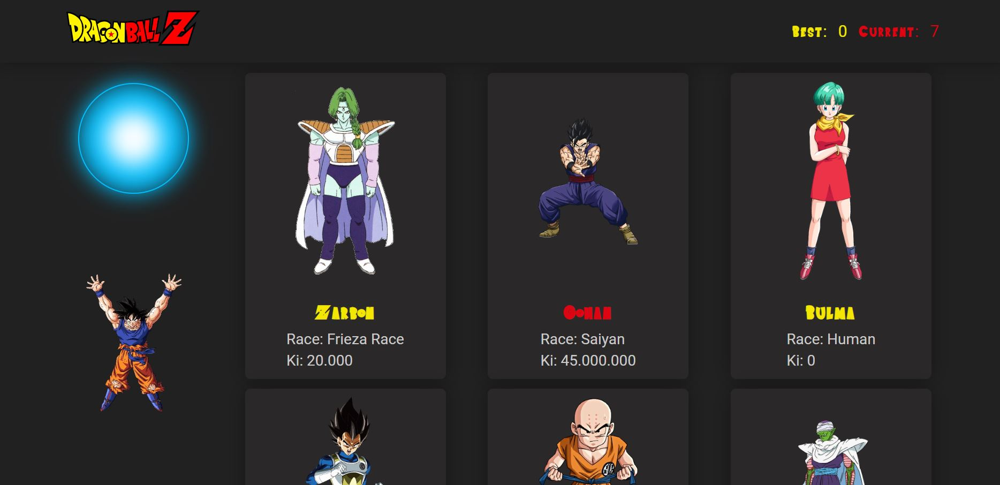
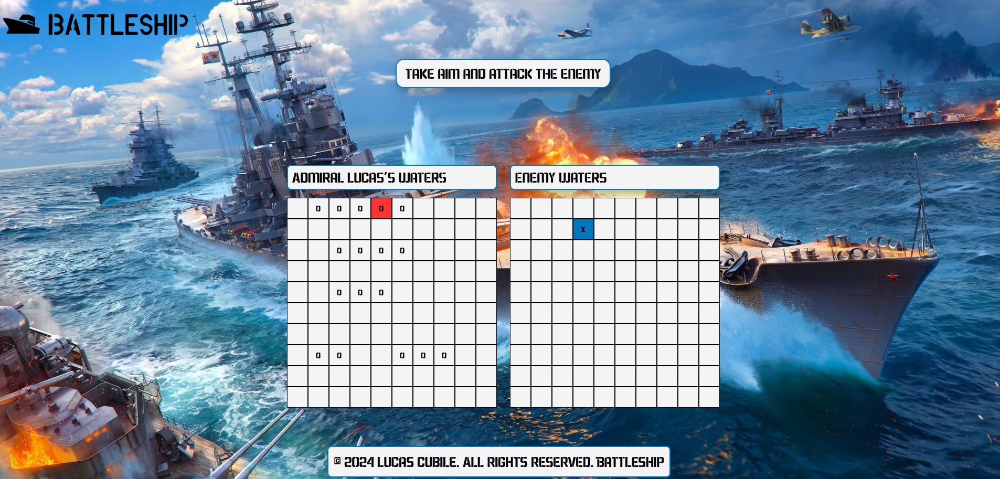
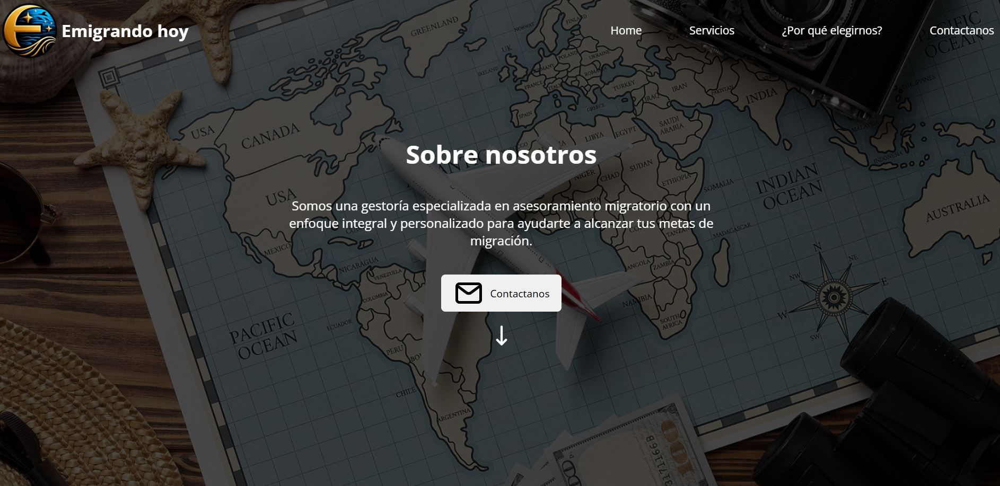

<h2 align="left"> 👋 About Me</h2>

<h3 align='center' style='font-size: 45px;'>  I'm Lucas, an English Major transitioning into Software Development going through college a second time. </h3>
 
 

- 🌱 I’m currently looking for a position as a Frontend, Backend or Fullstack developer. I hold EU citizenship

- 🎓 Currently I'm a student of a Bachelor's degree in information technologies. I’m also currently learning MongoDB, NextJs and NestJs. 

- ❓ Ask me about anything related to PERN/MERN stack and related technologies

 

<h2 align= "left"> 💻 Tech & Tools Preference</h2>

<table><tr><td valign="top" width="33%">

### Frontend

  
  
  

  

  

</td><td valign="top" width="33%">

### Backend

  
    
    
    
  
   

</td><td valign="top" width="33%">

  

### Learning / Other

  
  
  

</td></tr></table>

 

<h2 align='left'> 📖 Latest Projects</h2>

<h3 align='left'>Glamour Glow:</h3>
<h4>Connecting clients with service providers in the aesthetics industry</h4>

       

 

<a href="https://github.com/hroglardev/Glamour-Glow">📚 View the repository</a> 
<a href="https://www.youtube.com/watch?v=C99QeDGOOGc&ab_channel=Kndy">🎥 Video demo</a>

<h3 align='left'>DBZ - Memory Game:</h3>
<h4>Help Goku gather energy.</h4>

    

 

<a href="https://github.com/hroglardev/Memory-game">📚 View the repository</a> 
<a href="https://dbz-memory-game.vercel.app/">📡 Live Version</a> 

<h3 align='left'>Battleship:</h3>
<h4>Sink all the enemy ships before yours.</h4>

   

 

<a href="https://github.com/hroglardev/Battleship">📚 View the repository</a> 
<a href="https://hroglardev.github.io/Battleship/">📡 Live Version</a> 

<h3 align='left'>Emigrando Hoy:</h3>
<h4>Hire immigration services through our agency</h4>

   

 

<a href="https://github.com/hroglardev/Emigrando-Hoy">📚 View the repository</a> 
<a href="https://hroglardev.github.io/Emigrando-Hoy/">📡 Live Version</a> 
<a href="https://hroglardev.github.io/Emigrando-Hoy/">🎨 Figma Design</a>

<h3 align='left'>Travel Buddy:</h3>
<h4>Choose your next travel destination filtering by different criteria</h4>
<h4>Contribute on the website by adding activities to the countries</h4>

       

<a href="https://github.com/hroglardev/PI_Countries">📚 View the repository</a> 
<a href="https://countries-client-blue.vercel.app/">📡 Live version</a>

 

<h2 align="left"> 📫 Contact me</h2>

  

