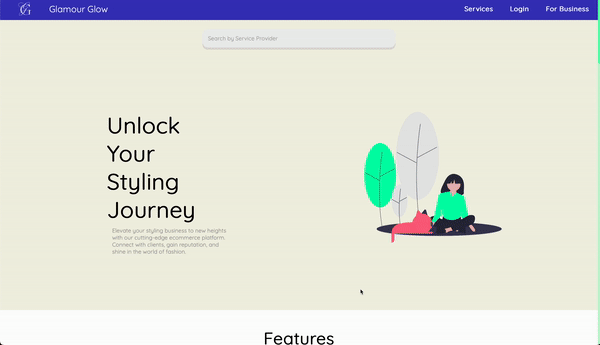
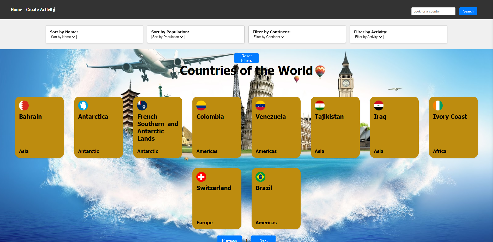

<h2 align="left"> 👋 About Me</h2>

<!--    -->

<h3 align='center' style='font-size: 45px;'>  I'm Lucas, an English Major transitioning into Software Development. </h3>
 
 

- 🌱 I’m currently looking for a position as a Frontend, Backend or Fullstack developer, preferably in the EU (even though I'm Argentinian, I hold EU citizenship and have lived in the EU in the past)

- 🎓 I’m currently learning TypeScript, MongoDB, NextJs and NestJs

- ❓ Ask me about anything related to PERN stack and related technologies

<!-- 
 -->
<!--  
  -->
 

<h2 align= "left"> 💻 Tech & Tools Preference</h2>

<table><tr><td valign="top" width="33%">

### Frontend

  
  
  
  

  
  

</td><td valign="top" width="33%">

### Backend

  
  
  
  

</td><td valign="top" width="33%">

### Learning

  
  
  
  

</td></tr></table>

<!-- 
 -->
<!--  
  -->
 

<h2 align='left'> 📖 Latest Projects</h2>

<h3 align='left'>Glamour Glow:</h3>
<h4>Connecting clients with the aesthetic industry</h4>

     

 

<!-- 
A marketplace app built to connect service providers with clients in the aesthetics industry. The app consists of three different roles: Customers, Service providers and the platform Admin who can moderate the platform. My contributions to the project consisted of:

• Design of the service-provider views.
• Implementation of favourites for users.
• E-mail notifications for users, service providers and the app admins using nodemailer.
• Full integration of a payment gateway using MercadoPago’s API including updates of balance and requesting payouts.
• Submission of reports for, admin moderation of the website.
• Navigation through the website.

I was focused on mainly on the frontend using technologies like React, TypeScript and Redux for state management as well some some UI libraries like Material UI. On the backend I designed the e-mails to send the notifications as well as the payment gateway integration.
 -->

<a href="https://github.com/hroglardev/Glamour-Glow">📚 View the repository</a> 
<a href="https://glamour-glow-app.vercel.app/">📡 Live version</a> 
<a href="https://www.youtube.com/watch?v=C99QeDGOOGc&ab_channel=Kndy">🎥 Video demo</a>

<h3 align='left'>Travel Buddy:</h3>

    

<!-- 
A single page application to load a PostgreSQL database with countries retrieved from a JSON local API. The model right now is an MVP with future features incoming.

This app includes the functionality for the user to create activities and assign them to their respective countries through a form.

I used React.js for Frontend development together with Redux to manage global state as well as CSS to add basic styling.

For the back-end I opted for Node.js environment using Express.js as a framework together with Sequelize ORM to manage a PostgreSQL database.

In the future this app will get a revamp to add functionalities as well as swap styling to use my preferred CSS too: TailwindCSS
 -->

<a href="https://github.com/hroglardev/PI_Countries">📚 View the repository</a> 
<a href="https://countries-client-blue.vercel.app/">📡 Live version</a>

<!-- 
 -->
<!--  
  -->
 

<h2 align="left"> 📫 Contact me</h2>

  

